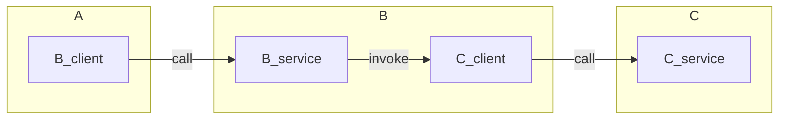

# ROS2 - Set C from A via B

This example implements the answer given in [ROS2 rclpy - Call a Service from inside a Service](https://answers.ros.org/question/342302/ros2-rclpy-call-a-service-from-inside-a-service/) on ROS Answers. Since ROS Answers in deprecated and read-only as of this writing, I am posting the answer here in case it is useful to others.

The answer was given in C++ and in a different context. This example is a translation of the answer to Python within the context of the original question.

## Usage

Input

| Terminal | Command |
|----------|---------|
| Terminal 1 (A) | `ros2 run set_c_from_a_via_b node_A` |
| Terminal 2 (B) | `ros2 run set_c_from_a_via_b node_B` |
| Terminal 3 (C) | `ros2 run set_c_from_a_via_b node_C` |

Expected Output

Terminal 1 (A)

```bash
started A_node
Calling B
example_interfaces.srv.SetBool_Response(success=True, message='')
```

Terminal 2 (B)

```bash
started B_node
recieved request
calling C
finished C
Done
```

Terminal 3 (C)

```bash
started C_node
recieved request
self.C = True
Done
```

## Explanation

The example consists of three nodes, A, B, and C. Node A calls a service in node B. Node B calls a service in node C. Node C sets a variable and returns.


